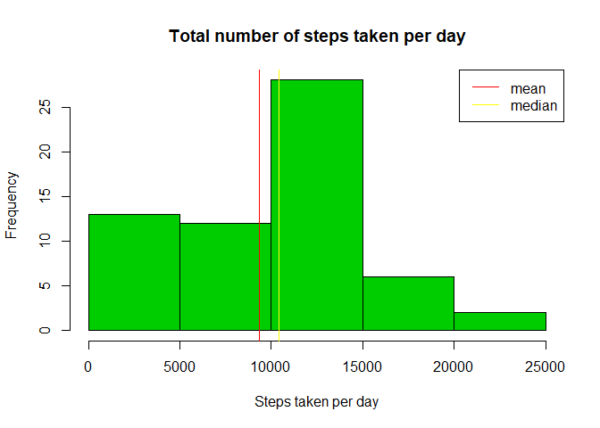

## Introduction

It is now possible to collect a large amount of data about personal
movement using activity monitoring devices such as a
[Fitbit](http://www.fitbit.com), [Nike
Fuelband](http://www.nike.com/us/en_us/c/nikeplus-fuelband), or
[Jawbone Up](https://jawbone.com/up). These type of devices are part of
the "quantified self" movement -- a group of enthusiasts who take
measurements about themselves regularly to improve their health, to
find patterns in their behavior, or because they are tech geeks. But
these data remain under-utilized both because the raw data are hard to
obtain and there is a lack of statistical methods and software for
processing and interpreting the data.

This assignment makes use of data from a personal activity monitoring
device. This device collects data at 5 minute intervals through out the
day. The data consists of two months of data from an anonymous
individual collected during the months of October and November, 2012
and include the number of steps taken in 5 minute intervals each day.

## Data

The data for this assignment can be downloaded from the course web
site:

* Dataset: [Activity monitoring data](https://d396qusza40orc.cloudfront.net/repdata%2Fdata%2Factivity.zip) [52K]

The variables included in this dataset are:

* **steps**: Number of steps taking in a 5-minute interval (missing
    values are coded as `NA`)

* **date**: The date on which the measurement was taken in YYYY-MM-DD
    format

* **interval**: Identifier for the 5-minute interval in which
    measurement was taken


The dataset is stored in a comma-separated-value (CSV) file and there
are a total of 17,568 observations in this
dataset.

## Loading and preprocessing the data


```r
activity<-readr::read_delim("activity.zip",delim = ",")
```

```
## Parsed with column specification:
## cols(
##   steps = col_double(),
##   date = col_date(format = ""),
##   interval = col_double()
## )
```

## What is mean total number of steps taken per day?  

How many steps is taken per day? As we can see on histogram below most frequenty it's between 10000 and 15000 steps per day.


```r
library(dplyr)
```

```
## 
## Attaching package: 'dplyr'
```

```
## The following objects are masked from 'package:stats':
## 
##     filter, lag
```

```
## The following objects are masked from 'package:base':
## 
##     intersect, setdiff, setequal, union
```

```r
  total_steps_day<-activity %>% select(steps,date) %>% group_by(date) %>% summarize(steps=sum(steps,na.rm=TRUE)) 
  
  
  total_steps_day_mean<-total_steps_day%>%ungroup() %>% summarize(mean_steps_per_day=mean(steps,na.rm=TRUE))
  
  total_steps_day_median<-total_steps_day%>%ungroup() %>% summarize(median_steps_per_day=median(steps,na.rm=TRUE))
```
To be specific median of number of steps is 1.0395\times 10^{4} and mean 9354.2295082.


```r
  hist(total_steps_day$steps, main ="Total number of steps taken per day", xlab = "Steps taken per day",freq = TRUE,col = 3 )
  
  abline(v = total_steps_day_mean$mean_steps_per_day, col = 2)
  
  abline(v = total_steps_day_median$median_steps_per_day, col = 7)
  legend("topright",legend = c("mean","median"),col = c(2,7),lty = 1)
```

<!-- -->


## What is the average daily activity pattern?  
During day activity differs so we should expect that nubers of steps would be different for different parts of day. On plot below we see average activity pattern in 5 minutes intervals during the day.


```r
average_steps_interval <- activity %>% select(steps, interval) %>% group_by(interval) %>% summarize(steps = mean(steps, na.rm = TRUE))


plot(x = average_steps_interval$interval , y = average_steps_interval$steps, type = "l", xlab = "time of day", ylab = "number of steps",xaxt="n")
axis(1, at=c(0,600,1200,1800), labels=c("0:00","6:00","12:00","18:00"))
```

<!-- -->

```r
maxinterval<-average_steps_interval %>% ungroup() %>% mutate(stepsmax =  max(steps)) %>% filter(steps == stepsmax)


xtimemax<- sprintf("%04d", maxinterval$interval)
htimemax <-substr(xtimemax,1,2)
mtimemax<-substr(xtimemax,3,4)

timemax<-paste0(htimemax,':',mtimemax)
```

In our dataset most steps are made during 08:35 interval and it's 206.1698113 steps.


## Imputing missing values
Unfortunately our data has missing values. 


```r
missing_values_sum<-sum(is.na(activity$steps))
```
To be specific we have 2304 missing values. Let's replace them by mean of steps for corresponding interval.


```r
activityfull<-activity %>% mutate(steps=ifelse(is.na(steps),average_steps_interval$steps,steps))
```
Once again let's look for histogram of total numbers of steps taken per day. This time for data without missing values.


```r
  total_steps_day_f<-activityfull %>% select(steps,date) %>% group_by(date) %>% summarize(steps=sum(steps,na.rm=TRUE)) 
  hist(total_steps_day_f$steps, main ="Total number of steps taken per day", xlab = "Steps taken per day",freq = TRUE,col = 3 )
  total_steps_day_mean_f<-total_steps_day_f%>%ungroup() %>% summarize(mean_steps_per_day=mean(steps,na.rm=TRUE))
  
  abline(v = total_steps_day_mean_f$mean_steps_per_day, col = 2)
  
total_steps_day_median_f<-total_steps_day_f%>%ungroup() %>% summarize(median_steps_per_day=median(steps,na.rm=TRUE))

  abline(v = total_steps_day_median_f$median_steps_per_day, col = 7)
  
  legend("topright",legend = c("mean","median"),col = c(2,7),lty = 1)
```

<!-- -->

Median is now equal to 1.0766189\times 10^{4} and mean is equal to 1.0766189\times 10^{4}.


## Are there differences in activity patterns between weekdays and weekends?

People behave differently on weekdays and weekends. Let's see if the activity pattern for those days is different.


```r
Sys.setlocale(category = "LC_ALL", locale = "English_United States.1252")
```

```
## [1] "LC_COLLATE=English_United States.1252;LC_CTYPE=English_United States.1252;LC_MONETARY=English_United States.1252;LC_NUMERIC=C;LC_TIME=English_United States.1252"
```

```r
weekday<-weekdays(activityfull$date)
activityfullweekends<-activityfull%>%filter(weekdays(activityfull$date) %in% c("Saturday", "Sunday"))
activityfullworkdays<-activityfull%>%filter(!(weekdays(activityfull$date) %in% c("Saturday", "Sunday")))


av_steps_interval_weekends <- activityfullweekends %>% select(steps, interval) %>% group_by(interval) %>% summarize(steps = mean(steps, na.rm = TRUE))


av_steps_interval_workdays <- activityfullworkdays %>% select(steps, interval) %>% group_by(interval) %>% summarize(steps = mean(steps, na.rm = TRUE))


par(mfrow = c(2,1))


plot(x = av_steps_interval_weekends$interval , y = av_steps_interval_weekends$steps, type = "l",main = "Weekend", xlab = "time of day", ylab = "number of steps",xaxt="n")
axis(1, at=c(0,600,1200,1800), labels=c("0:00","6:00","12:00","18:00"))


plot(x = av_steps_interval_workdays$interval , y = av_steps_interval_workdays$steps, type = "l",main ="Weekday", xlab = "time of day", ylab = "number of steps",xaxt="n")
axis(1, at=c(0,600,1200,1800), labels=c("0:00","6:00","12:00","18:00"))
```

<!-- -->
  
We can see that on weekends the number of steps during all day is less variable. On weekday we can observe peak about 8:30 and a smaller one after 18:00.
